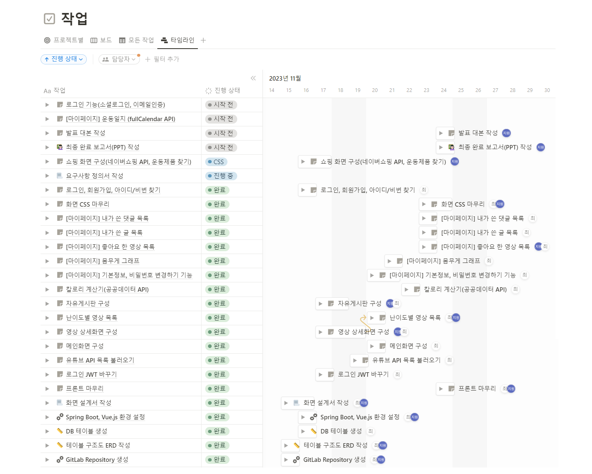
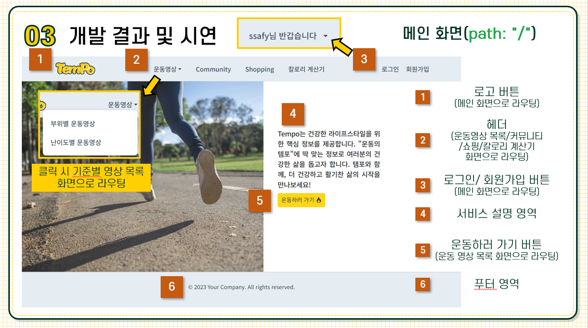
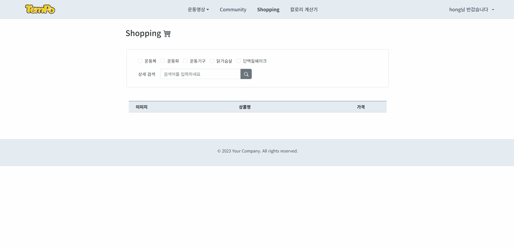

# 🏃‍♀️ TemPo 💨

    

  🌈 **"운동의 템포"에 맞는 정보로 TemPo와 함께 건강한 삶의 시작을** 🌈

 

# 📖 프로젝트 소개
> "TemPo"는 집에서 운동을 하고싶은 운동인들을 위한 통합 웹 서비스입니다.   사용자를 위한 운동 영상 추천은 물론, 서로 소통하고 정보를 공유함으로써 운동에 대한 편의성과 접근성을 높일 수 있습니다. 템포와 함께, 더 건강하고 활기찬 삶의 시작을 만나보세요.  

# 💻 메인 화면

# 📋 개발 배경

# ⚙ 개발 환경

- Figma로 목업 작업, Notion으로 스케줄 관리
- 로그인은 JWT토큰 사용 -> SessionStorage에서 관리  
 

# 📂 ERD

# 👩‍🏫 기능 설명

그 외 기능들
- 아이디, 비밀번호 찾기
- 좋아요 누른 영상 목록
- 내가 쓴 글/댓글 목록  
 

# 🙋‍♀️ 역할 분담

